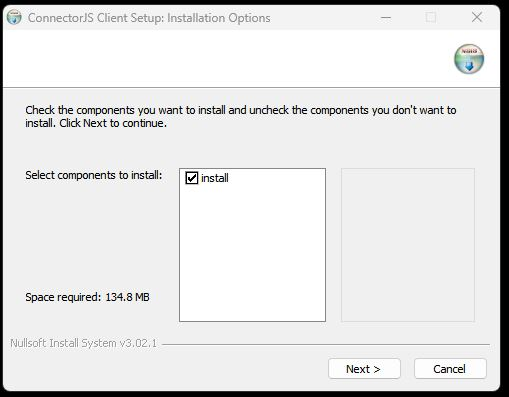
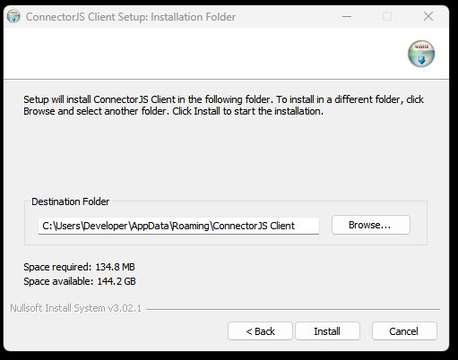
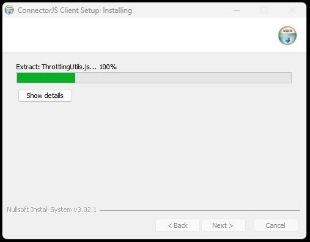
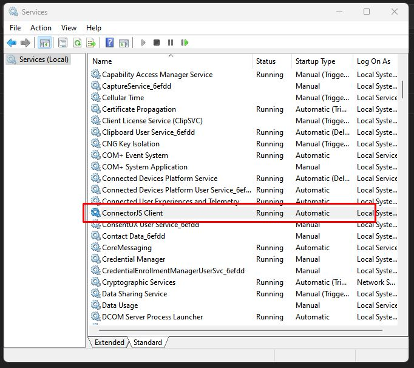
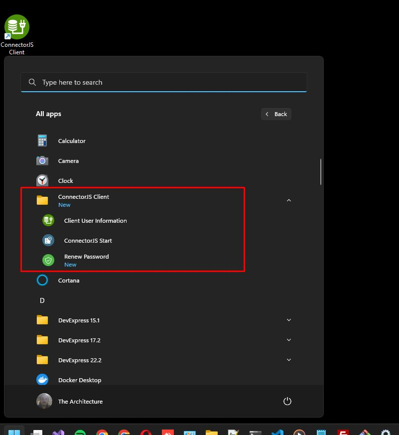
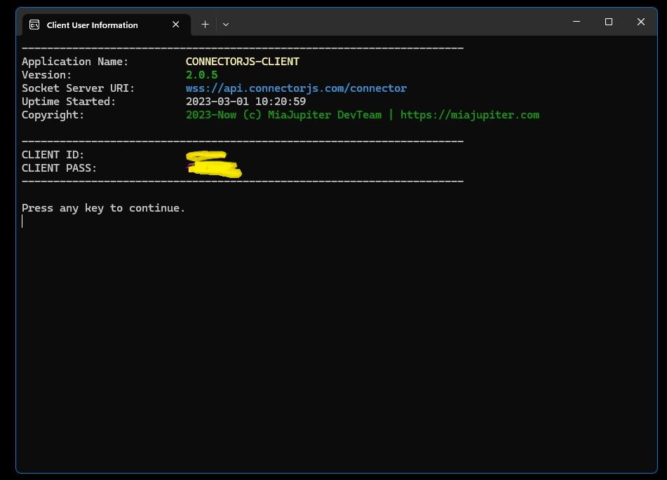

<p align="center">
<a href="https://connectorabi.com" _target="blank">

</a>
</p>

[](https://aliabi.org) 

# ConnectorAbi Client


Establish easy and secure remote connection to your local databases, files, etc.


## Install

### Npm / yarn

```bash
# npm / yarn install globally
$ npm install connectorabi -g

# Usage
$ connectorabi -h

Usage:
connectorabi <command> [options]

connectorabi start           run connector client
connectorabi show            show clientId and clientPass
connectorabi -v[--version]   version number
connectorabi -h[--help]      help

Press any key to continue.
```

### Windows

#### Download for Windows
Extract zip and install setup file [connectorabi-client-setup.zip](./installer/win64/connectorabi-client-setup.zip)


#### Screenshots

 <a href="./docs/screen-shots/Screenshot_0_1.jpg" target="_blank">
 </a>  <a href="./docs/screen-shots/Screenshot_0_2.jpg" target="_blank">

</a> <a href="./docs/screen-shots/Screenshot_0_3.jpg" target="_blank">

</a>  <a href="./docs/screen-shots/Screenshot_1.jpg" target="_blank"></a>  <a href="./docs/screen-shots/Screenshot_2.jpg" target="_blank">

</a> <a href="./docs/screen-shots/Screenshot_3.jpg" target="_blank">

</a>
----


### MacOS X
... soon

or try install via npm/yarn package managers.

### Linux / Ubuntu

- Download shell script

```bash
sudo wget ./installer/linux/install-connectorabi.sh

sudo chmod +x install-connectorabi.sh
sudo ./install-connectorabi.sh
...
...
```

OR

- Run all commands in terminal directly

```bash
sudo apt-get install node wget -y
sudo npm install -g pm2 -y
sudo wget https://github.com/connectorabi/connector-client/archive/refs/heads/main.zip -O /tmp/cc.zip
sudo unzip /tmp/cc.zip -d /opt/
sudo mv /opt/connector-client-main /opt/connectorabi
sudo rm /tmp/cc.zip
cd /opt/connectorabi
sudo npm install
sudo pm2 start connector-client.js
sudo pm2 startup
sudo pm2 save

echo "connectorabi installed"

```


- `.env` file

```ini
SOCKET_SERVER_URL=wss://kernel.connectorabi.com/
RECONNECTION_INTERVAL=20000
NODE_ENV={{develoment | production}}
CLIENT_ID={{client_id}}
CLIENT_PASS={{client_pass}}
```
